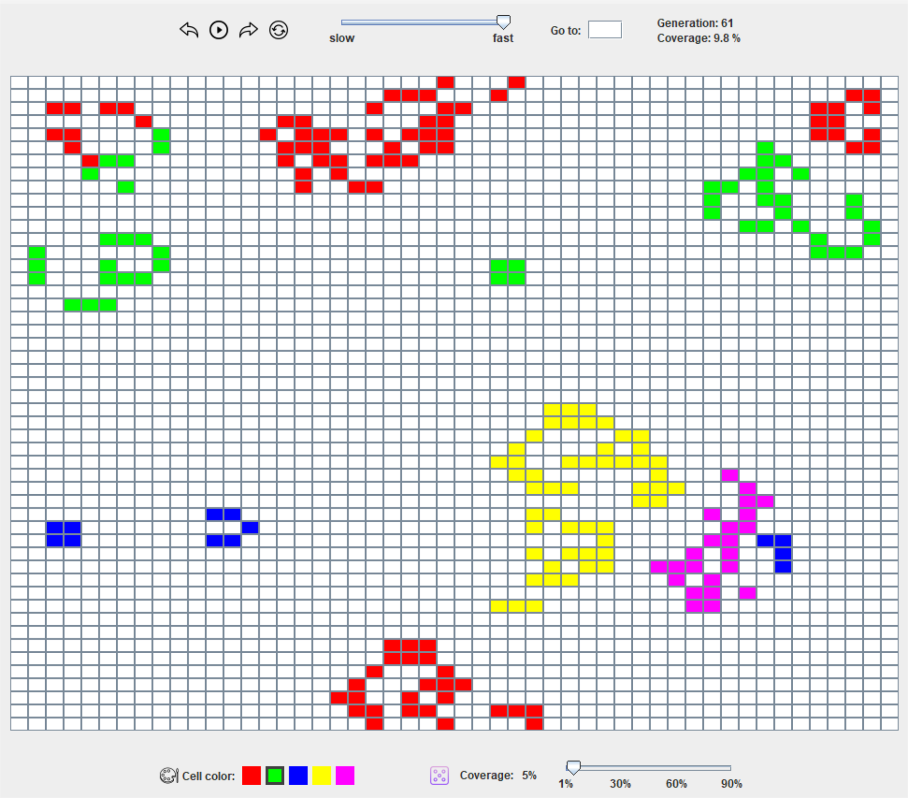

# Game of life

This is an implementation of Conway's Game of Life (see https://en.wikipedia.org/wiki/Conway%27s_Game_of_Life)

# Features

- go to the next or previous generation
- pause the game
- set the speed of the game
- go to a specific generation
- show the current generation number
- show the percentage of the field covered with cells (coverage)
- create cells with different colors
- bring cells to life during the game
- randomly create cells with a specific coverage (not yet implemented)
